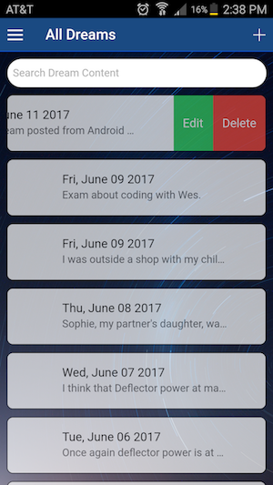

NocJournal
=====================

NocJournal allows the user log dreams, search a library of dream symbolism and interpretation, and review personal dream patterns and statistics to gain insight and aid self-growth and awareness.

NocJournal is a mobile app developed for iOS and Android with Ionic Framework.


## Features
 | 

#### Dream Journal
Users can log their dreams, providing relevant information such as the description, personal reflections, the degree of lucidity, the overall emotion, and whether it was a nightmare or recurring dream.

 | 

#### Symbolism Library
Explore meanings and interpretations of a variety of symbols that you may encounter in your dreams.

#### User Statistics

A statistics page provides the user with information regarding trends and patterns in their dreams based on the dreams they have logged.


## Installation
The repository can be downloaded and run as a web application for development/testing:

1. Run npm install to download necessary dependencies.
2. Make sure Ionic v1 is installed: http://ionicframework.com/getting-started
3. In the terminal, use Ionic to run the application:
```
$ ionic serve
```

Native mobile downloads of the app are currently only available with beta test versions (iOS/Android) in the Apple iOS store and the Google Play store.

## Technology
AngularJS, Ionic v1, JavaScript, Node.js, PostgreSQL, ExpressJS, Knex.js, SASS, Bootstrap

## API Backend

Backend repositories can be found at:
Dream Symbolism API:
- https://github.com/missalyss/dream_symbolism_api
- https://dream-symbolism-api.herokuapp.com/

NocJournal backend:
- https://github.com/missalyss/dream_frog
- Deployed site omitted for privacy

## Our Project

Contact developers for information on how to download the app through iOS' Testflight or on Android through the Google Play store.


## Developed By:

John Seymour: https://github.com/andromeda111

Alyssa Evans: https://github.com/missalyss

Amalia Fergin: https://github.com/amaliaclaire

Stefan Baatz: https://github.com/Baatzy
